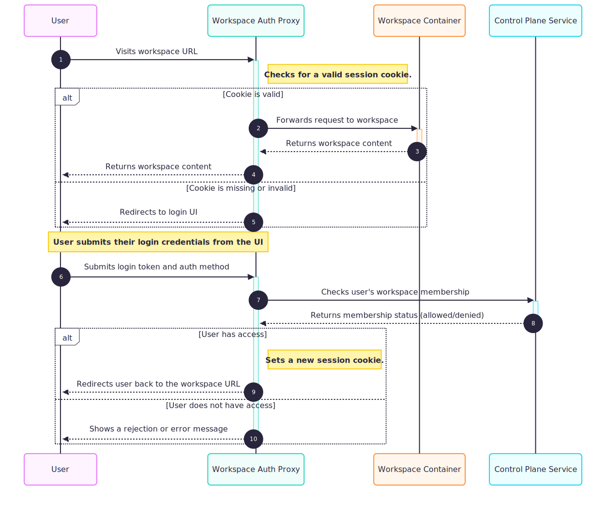

# Ddn-workspace Helm Chart

This chart deploys DDN Workspace (Native Runtime).

## Install Chart

See all [configuration](#parameters) below.

```bash
# EXAMPLES:

# helm template and apply manifests via kubectl (example)
helm template <release-name> \
  --set namespace="workspace" \
  --set global.domain="my-dp.domain.com" \
  --set global.tag="image_tag" \
  --set consoleUrl="https://console.my-cp.domain.com" \
  --set secrets.password="argon2id_hashed_password" \
  hasura-ddn/ddn-workspace | kubectl apply -f-

# helm upgrade --install (pass configuration via command line)
helm upgrade --install <release-name> \
  --set namespace="workspace" \
  --set global.domain="my-dp.domain.com" \
  --set global.tag="image_tag" \
  --set consoleUrl="https://console.my-cp.domain.com" \
  --set secrets.password="argon2id_hashed_password" \
  hasura-ddn/ddn-workspace
```

## Install Chart (Where PromptQL services are installed under Control Plane)

See all [configuration](#parameters) below.

```bash
# EXAMPLES:

# helm template and apply manifests via kubectl (example)
helm template <release-name> \
  --set namespace="workspace" \
  --set global.domain="my-dp.domain.com" \
  --set global.tag="image_tag" \
  --set consoleUrl="https://console.my-cp.domain.com" \
  --set ddnPromptqlEndpoint="https://promptql-cp.domain.com/graphql" \
  --set secrets.password="argon2id_hashed_password" \
  hasura-ddn/ddn-workspace | kubectl apply -f-

# helm upgrade --install (pass configuration via command line)
helm upgrade --install <release-name> \
  --set namespace="workspace" \
  --set global.domain="my-dp.domain.com" \
  --set global.tag="image_tag" \
  --set consoleUrl="https://console.my-cp.domain.com" \
  --set ddnPromptqlEndpoint="https://promptql-cp.domain.com/graphql" \
  --set secrets.password="argon2id_hashed_password" \
  hasura-ddn/ddn-workspace
```

## Install Chart (With an overrides file)

Here's an example of an overrides file, targeting `2.6.1` image tag:

```yaml
global:
  certIssuer: "letsencrypt-prod"
  uriScheme: "https"
  domain: "hasura-dp.domain.com"
  namespace: "default"
  subDomain: true
  serviceAccount:
    enabled: true
  securityContext:
    disabled: false
  imagePullSecrets:
    - "hasura-image-pull"

  ingress:
    enabled: true
    ingressClassName: nginx
    additionalAnnotations: |
      service.beta.kubernetes.io/aws-load-balancer-scheme: internet-facing
      service.beta.kubernetes.io/aws-load-balancer-type: nlb

consoleUrl: "https://console.my-cp.domain.com"
skipTlsVerify: false

image:
  tag: "2.6.1"

secrets:
  # Hashed password for code server (Argon2id hash)
  # This was generated using a dummy password
  password: "$argon2id$v=19$m=16,t=2,p=1$TGY1cnNQblpGNmlCSnV4VQ$1/DpAKkaZhEtHDyVBqpF9A"

  imagePullSecret:
    auths:
      gcr.io:
        username: "_json_key"
        # Below content should be replaced with "company-sa.json" file content which is shared by the Hasura team, ensuring that it's indented correctly.
        password: |
          {}
        email: "support@hasura.io"
```

Install via the following command:

```bash
helm upgrade --install <release-name> \
  -f overrides.yaml \
  hasura-ddn/ddn-workspace
```

## Install Chart (With an overrides file where PromptQL services are installed under Control Plane)

In addition to what is mentioned in section above, add the following into the overrides file:

```yaml
ddnPromptqlEndpoint: "https://promptql-cp.domain.com/graphql"
```
Install via the following command:

```bash
helm upgrade --install <release-name> \
  -f overrides.yaml \
  hasura-ddn/ddn-workspace
```

## Workspace Auth-Proxy

The DDN Workspace supports optional control plane authentication via an auth-proxy sidecar container. When enabled, the auth-proxy handles authentication against the control plane and checks workspace access of the token bearer via their access on the dataplane and forwards authenticated requests to the workspace.

**Important: If you are planning on using Workspace auth-proxy, you will need to ensure that you first have a workspace entry present in your database.  This entry would be created by running the below mutation on the data service.  A Control Plane Admin would be able to run this:**

CLOUD: Match with `cloud` value which is present for your data plane within `ddn.private_ddn` table.  Example: `gcp`
DDN_ID: Match with `id` value which is present for your data plane within `ddn.private_ddn` table.  Example: `f11afce9-ab0c-4620-b565-af9d94ce24ec`
HELM_RELEASE_NAME: Match with the Helm release name which you are using for your Workspace installation.  Example: `ws`
REGION: Match with `region` value which is present for your data plane within `ddn.private_ddn_region` table.  Example: `us-west2`

```
mutation {
  ddnInsertWorkspace(cloud: "CLOUD", ddn_id: "DDN_ID", name: "HELM_RELEASE_NAME", region: "REGION") {
    hashed_password
    id
  }
}
```

### Architecture Overview



### Authentication Methods

The auth-proxy supports multiple authentication methods:
- **PAT (Personal Access Token)**: Token-based authentication
- **OIDC Access Token**: OAuth 2.0 access token authentication
- **OIDC ID Token**: OpenID Connect ID token authentication

### Session Management

The auth-proxy provides comprehensive session management:
- **Login Endpoint**: `/auth` (POST) - Authenticate and create session
- **Logout Endpoint**: `/logout` (GET/POST) - Immediately invalidate session and clear cookies
- **Automatic Expiry**: Sessions automatically expire after the configured `maxAge` (default: 1 hour)
- **Secure Cookies**: HttpOnly, SameSite=Lax, Secure cookies for session management

### Usage Patterns

**Without Auth-Proxy (Default):**
```bash
# Direct workspace access - no authentication
helm upgrade --install <release-name> \
  --set global.domain="my-dp.domain.com" \
  --set secrets.password="argon2id_hashed_password" \
  hasura-ddn/ddn-workspace
```

**With Auth-Proxy Enabled:**
```bash
# Enable auth-proxy with all authentication methods (no password needed)
helm upgrade --install <release-name> \
  --set global.domain="my-dp.domain.com" \
  --set workspaceAuthProxy.enabled=true \
  hasura-ddn/ddn-workspace
```

**With Specific Auth Methods:**
```bash
# Enable only PAT and OIDC access token authentication
helm upgrade --install <release-name> \
  --set global.domain="my-dp.domain.com" \
  --set workspaceAuthProxy.enabled=true \
  --set workspaceAuthProxy.auth.enabledMethods="pat,oidc-access-token" \
  hasura-ddn/ddn-workspace
```

### Logout Usage

To logout from a workspace with auth-proxy enabled:

**Subdomain Mode:**
```bash
# GET request
curl -X GET https://my-workspace.my-dp.domain.com/logout

# POST request
curl -X POST https://my-workspace.my-dp.domain.com/logout
```

**Path-based Mode:**
```bash
# GET request
curl -X GET https://my-dp.domain.com/my-workspace/logout

# POST request
curl -X POST https://my-dp.domain.com/my-workspace/logout
```

Both methods will immediately invalidate the session cookie and return:
```json
{"status":"success","message":"Logged out successfully"}
```

### Important Notes

- **Only `workspaceAuthProxy.enabled=true` is required** for auth-proxy to be active
- When auth-proxy is enabled, `secrets.password` is ignored (auth-proxy handles authentication)
- When auth-proxy is disabled, `secrets.password` is required for workspace access
- When auth-proxy is enabled, only port 8080 is exposed externally (auth-proxy port)
- When auth-proxy is disabled, only port 8123 is exposed externally (workspace port)
- Auth-proxy admin port (9901) is never exposed externally for security
- **Logout endpoint** (`/logout`) immediately invalidates sessions for enhanced security

## Trusting CA certs

If you are using an SSL Certificate under your Control Plane ingresses which is tied to a CA (Certificate Authority) that is only trusted by your company, you
will need to follow instructions here.  We need to ensure that the DDN Workspace is able to trust this CA.

Note: The lifecycle of the ConfigMap or Secret, whichever you choose to use, is fully managed by you.

1. Grab the Intermediate + Root certs and save it to a .crt file
2. Create a secret or a configMap for this cert by running either:
    - Secret: `kubectl create secret -n <namespace> generic ca-cert --from-file=path/to/cert.crt`
    - ConfigMap: `kubectl create configmap -n <namespace> ca-cert --from-file=path/to/cert.crt`
3. Add the following into your DDN Workspace overrides file.  Add this outside of the scope of the `global` section:

```yaml title="When using configMap"
extraVolumes: |
  - name: ddn-workspace-data
  {{- if and (.Values.persistence).enabled (.Values.global.persistence).enabled }}
    persistentVolumeClaim:
      claimName: {{ include "common.name" . }}-data
  {{- else }}
    emptyDir: {}
  {{- end }}  
  - name: ca-cert
    secret:
      secretName: ca-cert

extraVolumeMounts: |
  - mountPath: /workspace
    name: ddn-workspace-data
  - name: ca-cert
    mountPath: /etc/ssl/certs
```

```yaml title="When using secret"
extraVolumes: |
  - name: ddn-workspace-data
  {{- if and (.Values.persistence).enabled (.Values.global.persistence).enabled }}
    persistentVolumeClaim:
      claimName: {{ include "common.name" . }}-data
  {{- else }}
    emptyDir: {}
  {{- end }}  
  - name: ca-cert
    secret:
      secretName: ca-cert

extraVolumeMounts: |
  - mountPath: /workspace
    name: ddn-workspace-data
  - name: ca-cert
    mountPath: /etc/ssl/certs
    readOnly: true
```

## Argo2id Password

The value being passed to `secrets.password` needs to be an `Argo2id` hashed password.  You can use a tool like [this](https://argon2.online/) to generate the appropriate hash from a given password.
When you generate a password, make sure you choose `Argon2id` as the mode/variant (This is the recommended approach per [RFC 9106](https://datatracker.ietf.org/doc/html/rfc9106)).

You can also use [this](https://github.com/hasura/ddn-helm-charts/blob/main/scripts/argo2id.py) Python script provided that you installed the `argon2-cffi` package via `pip install argon2-cffi`.

Note that when you pass the password via `--set`, you will need to escape `$` as well as `,` that are contained within the password.  If you are using an overrides file, you do not need to escape.

## Image pull secret

The DDN Workspace Helm chart is configured by default to fetch from Hasura's own private registry.  You will need to obtain an image pull secret in order to pull from this registry or otherwise
contact the Hasura engineering team in order to obtain alternate methods for fetching the image.

## Images

Image versions can be found under DDN Workspace [Release Notes](https://ddn-cp-docs.hasura.io/ddn-workspace/release-notes/#ddn-workspace-release-notes).


## Accessing DDN Workspace (Native Runtime) and next steps

After installation, you can access the DDN Workspace (Native Runtime) via the ingress URL. To find the hostname needed for connecting, run the following command: `kubectl get ingress`.

For detailed instructions on the DDN Workspace (Native Runtime) workflow and to get started, refer to the [Getting Started Documentation](https://ddn-cp-docs.hasura.io/data-plane/ddn-workspace-workflow/).

To explore the release notes, which include details on connector support and other features, visit the DDN Workspace [Release Notes](https://ddn-cp-docs.hasura.io/data-plane/release-notes/#ddn-workspace-release-notes).

## Parameters

| Name                                              | Description                                                                                                | Value                           |
| ------------------------------------------------- | ---------------------------------------------------------------------------------------------------------- | ------------------------------- |
| `global.domain`                                   | Base domain for DDN Workspace                                                                              | `""`                            |
| `global.subDomain`                                | Use a subdomain for DDN Workspace                                                                          | `true`                          |
| `global.certIssuer`                               | Cert issuer to use for ingress                                                                             | `letsencrypt-prod`              |
| `global.uriScheme`                                | URI Scheme for DDN Workspace                                                                               | `https`                         |
| `global.containerRegistry`                        | Container registry to pull image from                                                                      | `gcr.io/hasura-ee`              |
| `global.persistence.enabled`                      | Create a PVC for persisting `/workspace` directory within the DDN Workspace                                | `true`                          |
| `global.serviceCatalog`                           | Defines outgoing (egress) to specific pods based on labels                                                 | `[{'name': 'data', 'port': 8080}, {'name': 'ddn-cps-engine', 'port': 3000}]` |
| `global.serviceAccount.enabled`                   | Create SA (hasura-image-pull)                                                                              | `true`                          |
| `global.routes.enabled`                           | Enable routes (For OpenShift)                                                                              | `false`                         | 
| `additionalLabels.group`                          | Assigns given value to label group                                                                         | `ddn-workspace`                 |
| `networkPolicy.ingress.enabled`                   | Allow or disallow incoming network traffic                                                                 | `true`                          |
| `networkPolicy.egress.enabled`                    | Alow or disallow egress network traffic                                                                    | `true`                          |
| `networkPolicy.egress.allowedApps`                | List of allow apps for egress                                                                              | `['data', 'ddn-cps-engine']`    |
| `useReleaseName`                                  | Use Release Name                                                                                           | `true`                          |
| `image.repository`                                | Image name                                                                                                 | `ddn-native-workspace`          |
| `image.tag`                                       | Image tag                                                                                                  | `""`                            |
| `replicas`                                        | Replica count                                                                                              | `1`                             |
| `httpPort`                                        | HTTP port which service run on                                                                             | `8123`                          |
| `setControlPlaneUrls`                             | Sets necessary Control Plane URLs                                                                          | `true`                          |
| `persistence.enabled`                             | Create a PVC for persisting `/workspace` directory within the DDN Workspace                                | `true`                          |
| `persistence.size`                                | PVC size                                                                                                   | `10Gi`                          |
| `healthChecks.enabled`                            | Enable Health checks                                                                                       | `true`                          |
| `healthChecks.livenessProbe`                      | Health check liveness probe                                                                                | `httpGet:\n  path: /healthz\n  port: 8123\n` |
| `healthChecks.readinessProbe`                     | Health check readiness probe                                                                               | `httpGet:\n  path: /healthz\n  port: 8123\n` |
| `securityContext.runAsUser`                       | Security context runAsUser                                                                                 | `10001`                         |
| `securityContext.fsGroup`                         | Security context file system group ID                                                                      | `10001`                         |
| `securityContext.runAsNonRoot`                    | Security context runAsNonRoot                                                                              | `true`                          |
| `resources.requests.cpu`                          | CPU requested for the container                                                                            | `500m`                          |
| `resources.requests.memory`                       | Memory requested for the container                                                                         | `2048Mi`                        |
| `resources.limits.memory`                         | Maximum memory allowed for the container                                                                   | `2048Mi`                        |
| `hostAliases[0].ip`                               | IP address to alias in `/etc/hosts`                                                                        | `"127.0.0.1"`                   |
| `hostAliases[0].hostnames[0]`                     | Hostname mapped to the alias IP                                                                            | `"local.hasura.dev"`            |
| `dataHost`                                        | Host URL for the data service                                                                              | `"http://data:8080"`            |
| `ddnCpsEngineHost`                                | Host URL for the CPS engine                                                                                | `"http://ddn-cps-engine:3000"`  |
| `consoleUrl`                                      | DDN Console URL (Uses FQDN, prefixed with scheme)                                                          | `""`                            |
| `ddnPromptqlEndpoint`                             | DDN PromptQL Endpoint (Uses FQDN, prefixed with scheme and appended with `/graphql`).  Only set if Control Plane has PromptQL services installed                       | `""`                            |
| `skipTlsVerify`                                   | Whether to skip TLS verification                                                                           | `false`                         |
| `secrets.password`                                | DDN Workspace password (Argon2id hash)                                                                     | `""`                            |
| `ingress.enabled`                                 | Enable or disable creation of ingress                                                                      | `true`                          |
| `ingress.ingressClassName`                        | Ingress class name                                                                                         | `nginx`                         |
| `ingress.hostName`                                | Ingress override hostname                                                                                  | `""`                            |
| `ingress.additionalAnnotations`                   | Ingress additional annotations                                                                             | `""`                            |
| `ingress.path`                                    | Ingress override path                                                                                      | `""`                            |
| `routes.enabled`                                  | Enable routes (For OpenShift)                                                                              | `false`                         |
| `workspaceAuthProxy.enabled`                      | Enable workspace auth-proxy sidecar (ignores secrets.password when enabled)                               | `false`                         |
| `workspaceAuthProxy.debug.enabled`                | Enable debug logging for auth-proxy                                                                        | `false`                         |
| `workspaceAuthProxy.image.repository`             | Auth-proxy image repository                                                                                 | `auth-proxy`                    |
| `workspaceAuthProxy.image.tag`                    | Auth-proxy image tag                                                                                        | `latest`                        |
| `workspaceAuthProxy.image.pullPolicy`             | Auth-proxy image pull policy                                                                               | `IfNotPresent`                  |
| `workspaceAuthProxy.cookie.name`                  | Session cookie name                                                                                         | `workspace-session`             |
| `workspaceAuthProxy.cookie.maxAge`                | Session cookie max age in seconds                                                                           | `3600`                          |
| `workspaceAuthProxy.cookieDomain`                 | Session cookie domain (auto-configured if empty)                                                           | `""`                            |
| `workspaceAuthProxy.auth.enabledMethods`          | Comma-separated auth methods: pat,oidc-access-token,oidc-id-token                                          | `pat,oidc-access-token,oidc-id-token` |
| `workspaceAuthProxy.auth.ui.title`                | Auth login page title                                                                                       | `DDN Workspace \| Login`        |
| `workspaceAuthProxy.service.port`                 | Auth-proxy HTTP port                                                                                        | `8080`                          |
| `workspaceAuthProxy.resources.requests.cpu`       | Auth-proxy CPU request                                                                                      | `100m`                          |
| `workspaceAuthProxy.resources.requests.memory`    | Auth-proxy memory request                                                                                   | `128Mi`                         |
| `workspaceAuthProxy.resources.limits.cpu`         | Auth-proxy CPU limit                                                                                        | `200m`                          |
| `workspaceAuthProxy.resources.limits.memory`      | Auth-proxy memory limit                                                                                     | `256Mi`                         |
