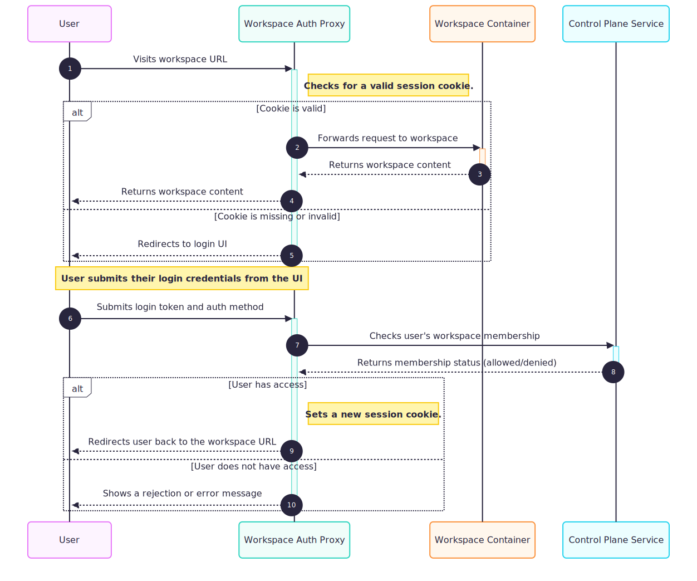

# Ddn-workspace Helm Chart

This chart deploys DDN Workspace (Native Runtime).

## DDN ID and Workspace Identification

When using the auth-proxy, workspaces can be associated with a specific DDN ID that identifies the data plane. This provides:

- **Workspace Isolation**: Ensures workspaces are scoped to the correct data plane
- **Resource Organization**: Allows filtering and managing workspaces by DDN ID using kubectl
- **Access Control**: Restricts workspace access to users with permissions on the specific data plane

### Usage with DDN ID

```bash
# Deploy workspace with DDN ID (auth-proxy only)
helm upgrade --install my-workspace \
  --set workspaceAuthProxy.enabled=true \
  --set workspaceAuthProxy.ddnId="my-data-plane-id" \
  hasura-ddn/ddn-workspace

# Find all resources for a specific DDN ID
kubectl get all -l ddn-id=my-data-plane-id

# Find all workspaces across all DDN IDs
kubectl get pods -l group=ddn-workspace
```

## Install Chart

See all [configuration](#parameters) below.

```bash
# EXAMPLES:

# helm template and apply manifests via kubectl (example)
helm template <release-name> \
  --set namespace="workspace" \
  --set global.domain="my-dp.domain.com" \
  --set global.tag="image_tag" \
  --set consoleUrl="https://console.my-cp.domain.com" \
  --set secrets.password="argon2id_hashed_password" \
  hasura-ddn/ddn-workspace | kubectl apply -f-

# helm upgrade --install (pass configuration via command line)
helm upgrade --install <release-name> \
  --set namespace="workspace" \
  --set global.domain="my-dp.domain.com" \
  --set global.tag="image_tag" \
  --set consoleUrl="https://console.my-cp.domain.com" \
  --set secrets.password="argon2id_hashed_password" \
  hasura-ddn/ddn-workspace
```

## Install Chart (Where PromptQL services are installed under Control Plane)

See all [configuration](#parameters) below.

```bash
# EXAMPLES:

# helm template and apply manifests via kubectl (example)
helm template <release-name> \
  --set namespace="workspace" \
  --set global.domain="my-dp.domain.com" \
  --set global.tag="image_tag" \
  --set consoleUrl="https://console.my-cp.domain.com" \
  --set ddnPromptqlEndpoint="https://promptql-cp.domain.com/graphql" \
  --set secrets.password="argon2id_hashed_password" \
  hasura-ddn/ddn-workspace | kubectl apply -f-

# helm upgrade --install (pass configuration via command line)
helm upgrade --install <release-name> \
  --set namespace="workspace" \
  --set global.domain="my-dp.domain.com" \
  --set global.tag="image_tag" \
  --set consoleUrl="https://console.my-cp.domain.com" \
  --set ddnPromptqlEndpoint="https://promptql-cp.domain.com/graphql" \
  --set secrets.password="argon2id_hashed_password" \
  hasura-ddn/ddn-workspace
```

## Install Chart (With an overrides file)

Here's an example of an overrides file, targeting `2.6.1` image tag:

```yaml
global:
  certIssuer: "letsencrypt-prod"
  uriScheme: "https"
  domain: "hasura-dp.domain.com"
  namespace: "default"
  subDomain: true
  serviceAccount:
    enabled: true
  securityContext:
    disabled: false
  imagePullSecrets:
    - "hasura-image-pull"

  ingress:
    enabled: true
    ingressClassName: nginx
    additionalAnnotations: |
      service.beta.kubernetes.io/aws-load-balancer-scheme: internet-facing
      service.beta.kubernetes.io/aws-load-balancer-type: nlb

consoleUrl: "https://console.my-cp.domain.com"
skipTlsVerify: false

image:
  tag: "2.6.1"

secrets:
  # Hashed password for code server (Argon2id hash)
  # This was generated using a dummy password
  password: "$argon2id$v=19$m=16,t=2,p=1$TGY1cnNQblpGNmlCSnV4VQ$1/DpAKkaZhEtHDyVBqpF9A"

  imagePullSecret:
    auths:
      gcr.io:
        username: "_json_key"
        # Below content should be replaced with "company-sa.json" file content which is shared by the Hasura team, ensuring that it's indented correctly.
        password: |
          {}
        email: "support@hasura.io"
```

Install via the following command:

```bash
helm upgrade --install <release-name> \
  -f overrides.yaml \
  hasura-ddn/ddn-workspace
```

## Install Chart (With an overrides file where PromptQL services are installed under Control Plane)

In addition to what is mentioned in section above, add the following into the overrides file:

```yaml
ddnPromptqlEndpoint: "https://promptql-cp.domain.com/graphql"
```
Install via the following command:

```bash
helm upgrade --install <release-name> \
  -f overrides.yaml \
  hasura-ddn/ddn-workspace
```

## Workspace Auth-Proxy

The DDN Workspace supports optional control plane authentication via an auth-proxy sidecar container. When enabled, the auth-proxy handles authentication against the control plane and checks workspace access of the token bearer via their access on the dataplane and forwards authenticated requests to the workspace.

**Important: If you are planning on using Workspace auth-proxy, you will need to ensure that you first have a workspace entry present in your database.  This entry would be created by running the below mutation on the data service.  A Control Plane Admin would be able to run this:**

- CLOUD: Match with `cloud` value which is present for your data plane within `ddn.private_ddn` table.  Example: `gcp`
- DDN_ID: Match with `id` value which is present for your data plane within `ddn.private_ddn` table.  Example: `f11afce9-ab0c-4620-b565-af9d94ce24ec`
- HELM_RELEASE_NAME: Match with the Helm release name which you are using for your Workspace installation.  This needs to be between 3 and 32 characters logs.  Example: `ws1`
- REGION: Match with `region` value which is present for your data plane within `ddn.private_ddn_region` table.  Example: `us-west2`

```
mutation {
  ddnInsertWorkspace(cloud: "CLOUD", ddn_id: "DDN_ID", name: "HELM_RELEASE_NAME", region: "REGION") {
    hashed_password
    id
  }
}
```

### Architecture Overview



### Authentication Methods

The auth-proxy supports multiple authentication methods:
- **PAT (Personal Access Token)**: Token-based authentication
- **OIDC Access Token**: OAuth 2.0 access token authentication
- **OIDC ID Token**: OpenID Connect ID token authentication

### Session Management

The auth-proxy provides comprehensive session management:
- **Login Endpoint**: `/auth` (POST) - Authenticate and create session
- **Logout Endpoint**: `/logout` (GET/POST) - Immediately invalidate session and clear cookies
- **Automatic Expiry**: Sessions automatically expire after the configured `maxAge` (default: 1 hour)
- **Secure Cookies**: HttpOnly, SameSite=Lax, Secure cookies for session management

### Usage Patterns

**Without Auth-Proxy (Default):**
```bash
# Direct workspace access - no authentication
helm upgrade --install <release-name> \
  --set global.domain="my-dp.domain.com" \
  --set secrets.password="argon2id_hashed_password" \
  hasura-ddn/ddn-workspace
```

**With Auth-Proxy Enabled:**
```bash
# Enable auth-proxy with all authentication methods (no password needed)
helm upgrade --install <release-name> \
  --set global.domain="my-dp.domain.com" \
  --set workspaceAuthProxy.enabled=true \
  --set workspaceAuthProxy.ddnId="my-data-plane-id" \
  hasura-ddn/ddn-workspace
```

**With Specific Auth Methods:**
```bash
# Enable only PAT and OIDC access token authentication
helm upgrade --install <release-name> \
  --set global.domain="my-dp.domain.com" \
  --set workspaceAuthProxy.enabled=true \
  --set workspaceAuthProxy.auth.enabledMethods="pat,oidc-access-token" \
  --set workspaceAuthProxy.ddnId="my-data-plane-id" \
  hasura-ddn/ddn-workspace
```

### Logout Usage

To logout from a workspace with auth-proxy enabled:

**Subdomain Mode:**
```bash
# GET request
curl -X GET https://my-workspace.my-dp.domain.com/logout

# POST request
curl -X POST https://my-workspace.my-dp.domain.com/logout
```

**Path-based Mode:**
```bash
# GET request
curl -X GET https://my-dp.domain.com/my-workspace/logout

# POST request
curl -X POST https://my-dp.domain.com/my-workspace/logout
```

Both methods will immediately invalidate the session cookie and return:
```json
{"status":"success","message":"Logged out successfully"}
```

### Important Notes

- **Only `workspaceAuthProxy.enabled=true` is required** for auth-proxy to be active
- When auth-proxy is enabled, `secrets.password` is ignored (auth-proxy handles authentication)
- When auth-proxy is disabled, `secrets.password` is required for workspace access
- When auth-proxy is enabled, only port 8080 is exposed externally (auth-proxy port)
- When auth-proxy is disabled, only port 8123 is exposed externally (workspace port)
- Auth-proxy admin port (9901) is never exposed externally for security
- **Logout endpoint** (`/logout`) immediately invalidates sessions for enhanced security

## Home Persistence

The DDN Workspace supports persistent storage of the container's `/home` directory, which contains pre-installed tools, configurations, and development environment setup. This feature ensures that updates to the workspace image can be automatically applied while preserving user customizations.

**⚠️ Important: Home Persistence is disabled by default.** You must explicitly enable it by setting `homePersistence.enabled=true` in your configuration.

### Benefits of Home Persistence

When home persistence is enabled, users gain several important advantages:

**Development Continuity:**
- **DDN CLI version persistence**: The DDN CLI version remains static during pod reboots, ensuring consistent tooling
- **Authentication persistence**: Users stay logged in via `ddn auth login` - no need to re-authenticate after pod restarts
- **Command history persistence**: Shell command history is preserved across pod restarts for improved productivity

**Configuration & Customization:**
- **Custom tool installations persist**: Additional CLI tools, packages, or utilities installed by users remain available
- **SSH keys and credentials persist**: SSH keys, Git credentials, and authentication tokens are preserved
- **IDE/Editor configurations persist**: VS Code settings, extensions, and workspace configurations are maintained
- **Environment variables persist**: Custom `.bashrc`, `.zshrc`, `.profile` settings and environment customizations are retained
- **Git configuration persists**: User's Git config (name, email, aliases, signing keys) remains configured

**Performance & Efficiency:**
- **Project dependencies cache persist**: Node modules cache, Python virtual environments, and dependency caches speed up builds
- **Custom scripts and aliases persist**: User-defined scripts, shell aliases, and automation tools are preserved
- **Faster pod startup times**: After initial setup, pods start faster since tools and configurations are already in place
- **Consistent development environment**: Ensures the same development environment across pod restarts and team members

### How Home Persistence Works

**By default, home persistence is disabled** and the workspace uses the `/home` directory directly from the container image on each restart.

When you enable home persistence by setting `homePersistence.enabled=true`, the workspace creates a separate persistent volume specifically for home directory data. An init container runs before the main workspace container starts and handles copying data from the image's `/home` directory to the persistent volume based on the configured update strategy.

### Update Strategies

The `homePersistence.updateStrategy` parameter controls when and how the home directory is updated:

#### 1. `version-aware` (Default - Recommended for All Environments)
- **When it updates**: Only when the image tag changes
- **Behavior**: Syncs new files from `/home` in the image to persistent storage, preserving existing user files
- **User data**: Existing files are preserved (not overwritten)
- **Special handling**: The `/home/hasura/.local/lib/hasura` directory is always force-synced (overwritten) when the image version changes to ensure Connector plugins compatibility
- **Use case**: Ideal for both development and production environments - provides automatic updates while preserving user customizations

```yaml
homePersistence:
  updateStrategy: "version-aware"
```

**Example workflow:**
1. First deployment with `image.tag: "v1.0.0"` → Copies `/home` to persistent volume
2. User customizes tools and configs in `/home` (e.g., `.bashrc`, SSH keys)
3. Upgrade to `image.tag: "v1.1.0"` → Syncs new files from image, preserves user customizations
4. User customizations remain intact, new tools/configs from the image are added
5. The `/home/hasura/.local/lib/hasura` directory is overwritten with the new version to ensure Connector splugins compatibility

#### 2. `once` (Conservative - Legacy Approach)
- **When it updates**: Only on the very first pod start
- **Behavior**: Never updates after initial copy (except for Hasura library directory)
- **User data**: Always preserved (no overwrites)
- **Special handling**: The `/home/hasura/.local/lib/hasura` directory is still force-synced when the image version changes, even with this strategy
- **Use case**: Legacy environments where you prefer manual control over updates

```yaml
homePersistence:
  updateStrategy: "once"
```

**Example workflow:**
1. First deployment → Copies `/home` to persistent volume, creates `.initialized` marker
2. All subsequent deployments → Skips copy entirely, even with new image versions
3. User gets initial tools but **misses important updates, security fixes, and new features**
4. Exception: `/home/hasura/.local/lib/hasura` is still updated when image version changes

#### 3. `always` (Aggressive)
- **When it updates**: Every pod restart
- **Behavior**: Syncs files from `/home` in the image to persistent storage, preserving existing user files
- **Special handling**: The `/home/hasura/.local/lib/hasura` directory is force-synced when the image version changes
- **Use case**: Testing environments where you want to ensure all new files from the image are present

```yaml
homePersistence:
  updateStrategy: "always"
```

### Storage Configuration

Home persistence uses a separate PVC from the main workspace storage:

```yaml
# Workspace data (user projects, files)
persistence:
  enabled: true
  size: 10Gi

# Home directory data (tools, configs, environment)
homePersistence:
  enabled: true
  size: 10Gi                    # Usually smaller than workspace data
  accessMode: ReadWriteOnce
  storageClassName: "fast-ssd" # Optional: specify storage class
```

### Volume Mounts

The feature creates two separate persistent volumes:

- **Workspace Volume**: Mounted at `/workspace` (user projects and files)
- **Home Volume**: Mounted at `/persistent-home` (tools, configs, environment)

### Configuration Examples

**Production Environment (Recommended):**
```yaml
homePersistence:
  enabled: true
  size: 10Gi
  updateStrategy: "version-aware"
```

**Development Environment:**
```yaml
homePersistence:
  enabled: true
  size: 10Gi
  updateStrategy: "version-aware"
```

**Legacy Environment (Conservative - Not Recommended):**
```yaml
homePersistence:
  enabled: true
  size: 10Gi
  updateStrategy: "once"
```

**Testing Environment (Always Fresh):**
```yaml
homePersistence:
  enabled: true
  size: 10Gi
  updateStrategy: "always"
```

**Disabled (Default - No Home Persistence):**
```yaml
homePersistence:
  enabled: false  # This is the default behavior
```

When disabled, the workspace uses the `/home` directory directly from the container image on each restart. No persistent storage is created for home directory data.

### Configuring Bash History Persistence

To ensure your command history is properly persisted across pod restarts when home persistence is enabled, you need to configure bash to use a persistent history file. This configuration ensures that your shell history is saved immediately and survives pod restarts.

**Setup Instructions:**

1. Create or update your `~/.bashrc` file with the following configuration:

```bash
cat > ~/.bashrc <<'EOF'
# ---- Bash history persistence ----
export HISTFILE="$HOME/.bash_history"
export HISTSIZE=100000
export HISTFILESIZE=200000

shopt -s histappend
PROMPT_COMMAND='history -a; history -n'

# mise
eval "$(mise activate bash)"
EOF
```

2. Apply the configuration to your current session:

```bash
source ~/.bashrc
```

**Configuration Explanation:**

- `HISTFILE="$HOME/.bash_history"`: Explicitly sets the history file location in the home directory
- `HISTSIZE=100000`: Sets the number of commands to remember in the current session
- `HISTFILESIZE=200000`: Sets the maximum number of lines in the history file
- `shopt -s histappend`: Appends to the history file instead of overwriting it
- `PROMPT_COMMAND='history -a; history -n'`: Saves history after each command and reloads it
  - `history -a`: Appends current session history to the history file
  - `history -n`: Reads new history entries from the history file

**Note:** This configuration is only effective when home persistence is enabled (`homePersistence.enabled=true`). Without home persistence, the `~/.bashrc` file and `~/.bash_history` will be lost on pod restarts.

### Special Handling: DDN CLI Library Directory

The `/home/hasura/.local/lib/hasura` directory receives special treatment during updates to ensure Connector plugins compatibility:

**Behavior:**
- This directory is **always force-synced** (completely overwritten) when the image version changes
- This happens regardless of the `updateStrategy` setting (`once`, `always`, or `version-aware`)
- The force-sync ensures that the DDN CLI libraries match the version expected by the workspace image

**Why this is necessary:**
- The DDN CLI relies on specific library versions that must match the workspace environment
- Preserving old library versions could cause compatibility issues or runtime errors
- This ensures users always have the correct DDN CLI version after image updates

**What this means for users:**
- Custom modifications to `/home/hasura/.local/lib/hasura` will be lost on image version changes
- DDN CLI customizations should be done through configuration files, not by modifying library files
- All other directories in `/home` preserve user customizations according to the update strategy

### Important Notes

- **Disabled by Default**: Home persistence must be explicitly enabled with `homePersistence.enabled=true`
- **Separate from Workspace Data**: Home persistence is independent of the main workspace persistence
- **Image Updates**: Only `version-aware` strategy automatically applies image updates
- **No Backups Created**: The sync process preserves existing files rather than creating backups. Files are only added, not overwritten (except for the Hasura library directory)
- **Hasura Library Exception**: The `/home/hasura/.local/lib/hasura` directory is always overwritten on version changes to ensure Connector plugins compatibility
- **Init Container**: Uses the same image as the main container to ensure consistency
- **Storage Requirements**: Home directory typically needs 2-5GB depending on installed tools

### Troubleshooting

**Check Init Container Logs:**
```bash
kubectl logs <pod-name> -c copy-home
```

**Check Current Image Version:**
```bash
kubectl exec <pod-name> -- cat /home/.image-version
```

**Verify Initialization Status:**
```bash
kubectl exec <pod-name> -- ls -la /home/.initialized /home/.image-version
```

**Check Hasura Library Directory:**
```bash
kubectl exec <pod-name> -- ls -la /home/hasura/.local/lib/hasura
```

**Manually Trigger Home Directory Refresh:**
If you need to force a refresh of the home directory content, you can delete the pod to trigger a restart:
```bash
kubectl delete pod <pod-name>
```
The init container will run again and sync files according to the configured update strategy.

## Trusting CA certs

If you are using an SSL Certificate under your Control Plane ingresses which is tied to a CA (Certificate Authority) that is only trusted by your company, you
will need to follow instructions here.  We need to ensure that the DDN Workspace is able to trust this CA.

Note: The lifecycle of the ConfigMap or Secret, whichever you choose to use, is fully managed by you.

1. Grab the Intermediate + Root certs and save it to a .crt file
2. Create a secret or a configMap for this cert by running either:
    - Secret: `kubectl create secret -n <namespace> generic ca-cert --from-file=path/to/cert.crt`
    - ConfigMap: `kubectl create configmap -n <namespace> ca-cert --from-file=path/to/cert.crt`
3. Add the following into your DDN Workspace overrides file.  Add this outside of the scope of the `global` section:

```yaml title="When using configMap"
extraVolumes: |
  - name: ddn-workspace-data
  {{- if and (.Values.persistence).enabled (.Values.global.persistence).enabled }}
    persistentVolumeClaim:
      claimName: {{ include "common.name" . }}-data
  {{- else }}
    emptyDir: {}
  {{- end }}  
  - name: ca-cert
    secret:
      secretName: ca-cert

extraVolumeMounts: |
  - mountPath: /workspace
    name: ddn-workspace-data
  - name: ca-cert
    mountPath: /etc/ssl/certs
```

```yaml title="When using secret"
extraVolumes: |
  - name: ddn-workspace-data
  {{- if and (.Values.persistence).enabled (.Values.global.persistence).enabled }}
    persistentVolumeClaim:
      claimName: {{ include "common.name" . }}-data
  {{- else }}
    emptyDir: {}
  {{- end }}  
  - name: ca-cert
    secret:
      secretName: ca-cert

extraVolumeMounts: |
  - mountPath: /workspace
    name: ddn-workspace-data
  - name: ca-cert
    mountPath: /etc/ssl/certs
    readOnly: true
```

## Argo2id Password

The value being passed to `secrets.password` needs to be an `Argo2id` hashed password.  You can use a tool like [this](https://argon2.online/) to generate the appropriate hash from a given password.
When you generate a password, make sure you choose `Argon2id` as the mode/variant (This is the recommended approach per [RFC 9106](https://datatracker.ietf.org/doc/html/rfc9106)).

You can also use [this](https://github.com/hasura/ddn-helm-charts/blob/main/scripts/argo2id.py) Python script provided that you installed the `argon2-cffi` package via `pip install argon2-cffi`.

Note that when you pass the password via `--set`, you will need to escape `$` as well as `,` that are contained within the password.  If you are using an overrides file, you do not need to escape.

## Image pull secret

The DDN Workspace Helm chart is configured by default to fetch from Hasura's own private registry.  You will need to obtain an image pull secret in order to pull from this registry or otherwise
contact the Hasura engineering team in order to obtain alternate methods for fetching the image.

## Images

Image versions can be found under DDN Workspace [Release Notes](https://ddn-cp-docs.hasura.io/ddn-workspace/release-notes/#ddn-workspace-release-notes).

## Accessing DDN Workspace (Native Runtime) and next steps

After installation, you can access the DDN Workspace (Native Runtime) via the ingress URL. To find the hostname needed for connecting, run the following command: `kubectl get ingress`.

For detailed instructions on the DDN Workspace (Native Runtime) workflow and to get started, refer to the [Getting Started Documentation](https://ddn-cp-docs.hasura.io/data-plane/ddn-workspace-workflow/).

To explore the release notes, which include details on connector support and other features, visit the DDN Workspace [Release Notes](https://ddn-cp-docs.hasura.io/data-plane/release-notes/#ddn-workspace-release-notes).

## Parameters

| Name                                              | Description                                                                                                | Value                           |
| ------------------------------------------------- | ---------------------------------------------------------------------------------------------------------- | ------------------------------- |
| `global.domain`                                   | Base domain for DDN Workspace                                                                              | `""`                            |
| `global.subDomain`                                | Use a subdomain for DDN Workspace                                                                          | `true`                          |
| `global.certIssuer`                               | Cert issuer to use for ingress                                                                             | `letsencrypt-prod`              |
| `global.uriScheme`                                | URI Scheme for DDN Workspace                                                                               | `https`                         |
| `global.containerRegistry`                        | Container registry to pull image from                                                                      | `gcr.io/hasura-ee`              |
| `global.persistence.enabled`                      | Create a PVC for persisting `/workspace` directory within the DDN Workspace                                | `true`                          |
| `global.serviceCatalog`                           | Defines outgoing (egress) to specific pods based on labels                                                 | `[{'name': 'data', 'port': 8080}, {'name': 'ddn-cps-engine', 'port': 3000}]` |
| `global.serviceAccount.enabled`                   | Create SA (hasura-image-pull)                                                                              | `true`                          |
| `global.routes.enabled`                           | Enable routes (For OpenShift)                                                                              | `false`                         | 
| `additionalLabels.group`                          | Assigns given value to label group                                                                         | `ddn-workspace`                 |
| `networkPolicy.ingress.enabled`                   | Allow or disallow incoming network traffic                                                                 | `true`                          |
| `networkPolicy.egress.enabled`                    | Alow or disallow egress network traffic                                                                    | `true`                          |
| `networkPolicy.egress.allowedApps`                | List of allow apps for egress                                                                              | `['data', 'ddn-cps-engine']`    |
| `useReleaseName`                                  | Use Release Name                                                                                           | `true`                          |
| `image.repository`                                | Image name                                                                                                 | `ddn-native-workspace`          |
| `image.tag`                                       | Image tag                                                                                                  | `""`                            |
| `replicas`                                        | Replica count                                                                                              | `1`                             |
| `httpPort`                                        | HTTP port which service run on                                                                             | `8123`                          |
| `setControlPlaneUrls`                             | Sets necessary Control Plane URLs                                                                          | `true`                          |
| `persistence.enabled`                             | Create a PVC for persisting `/workspace` directory within the DDN Workspace                                | `true`                          |
| `persistence.size`                                | PVC size                                                                                                   | `10Gi`                          |
| `homePersistence.enabled`                         | Create a separate PVC for persisting `/home` directory data from the container image                       | `false`                          |
| `homePersistence.size`                            | Home persistence PVC size                                                                                  | `10Gi`                           |
| `homePersistence.accessMode`                      | Home persistence PVC access mode                                                                           | `ReadWriteOnce`                 |
| `homePersistence.storageClassName`                | Home persistence storage class name (optional)                                                            | `""`                            |
| `homePersistence.existingClaim`                   | Use existing PVC for home persistence (optional)                                                          | `""`                            |
| `homePersistence.updateStrategy`                  | Strategy for updating home directory: `once`, `always`, `version-aware`                                   | `version-aware`                 |
| `healthChecks.enabled`                            | Enable Health checks                                                                                       | `true`                          |
| `healthChecks.livenessProbe`                      | Health check liveness probe                                                                                | `httpGet:\n  path: /healthz\n  port: 8123\n` |
| `healthChecks.readinessProbe`                     | Health check readiness probe                                                                               | `httpGet:\n  path: /healthz\n  port: 8123\n` |
| `securityContext.runAsUser`                       | Security context runAsUser                                                                                 | `10001`                         |
| `securityContext.fsGroup`                         | Security context file system group ID                                                                      | `10001`                         |
| `securityContext.runAsNonRoot`                    | Security context runAsNonRoot                                                                              | `true`                          |
| `resources.requests.cpu`                          | CPU requested for the container                                                                            | `500m`                          |
| `resources.requests.memory`                       | Memory requested for the container                                                                         | `2048Mi`                        |
| `resources.limits.memory`                         | Maximum memory allowed for the container                                                                   | `2048Mi`                        |
| `hostAliases[0].ip`                               | IP address to alias in `/etc/hosts`                                                                        | `"127.0.0.1"`                   |
| `hostAliases[0].hostnames[0]`                     | Hostname mapped to the alias IP                                                                            | `"local.hasura.dev"`            |
| `dataHost`                                        | Host URL for the data service                                                                              | `"http://data:8080"`            |
| `ddnCpsEngineHost`                                | Host URL for the CPS engine                                                                                | `"http://ddn-cps-engine:3000"`  |
| `consoleUrl`                                      | DDN Console URL (Uses FQDN, prefixed with scheme)                                                          | `""`                            |
| `ddnPromptqlEndpoint`                             | DDN PromptQL Endpoint (Uses FQDN, prefixed with scheme and appended with `/graphql`).  Only set if Control Plane has PromptQL services installed                       | `""`                            |
| `skipTlsVerify`                                   | Whether to skip TLS verification                                                                           | `false`                         |
| `secrets.password`                                | DDN Workspace password (Argon2id hash)                                                                     | `""`                            |
| `ingress.enabled`                                 | Enable or disable creation of ingress                                                                      | `true`                          |
| `ingress.ingressClassName`                        | Ingress class name                                                                                         | `nginx`                         |
| `ingress.hostName`                                | Ingress override hostname                                                                                  | `""`                            |
| `ingress.additionalAnnotations`                   | Ingress additional annotations                                                                             | `""`                            |
| `ingress.path`                                    | Ingress override path                                                                                      | `""`                            |
| `routes.enabled`                                  | Enable routes (For OpenShift)                                                                              | `false`                         |
| `workspaceAuthProxy.enabled`                      | Enable workspace auth-proxy sidecar (ignores secrets.password when enabled)                               | `false`                         |
| `workspaceAuthProxy.ddnId`                        | DDN ID that identifies the data plane this workspace belongs to (required when auth-proxy is enabled)      | `""`                            |
| `workspaceAuthProxy.debug.enabled`                | Enable debug logging for auth-proxy                                                                        | `false`                         |
| `workspaceAuthProxy.image.repository`             | Auth-proxy image repository                                                                                 | `auth-proxy`                    |
| `workspaceAuthProxy.image.tag`                    | Auth-proxy image tag                                                                                        | `latest`                        |
| `workspaceAuthProxy.image.pullPolicy`             | Auth-proxy image pull policy                                                                               | `IfNotPresent`                  |
| `workspaceAuthProxy.cookie.name`                  | Session cookie name                                                                                         | `workspace-session`             |
| `workspaceAuthProxy.cookie.maxAge`                | Session cookie max age in seconds                                                                           | `3600`                          |
| `workspaceAuthProxy.cookieDomain`                 | Session cookie domain (auto-configured if empty)                                                           | `""`                            |
| `workspaceAuthProxy.auth.enabledMethods`          | Comma-separated auth methods: pat,oidc-access-token,oidc-id-token                                          | `pat,oidc-access-token,oidc-id-token` |
| `workspaceAuthProxy.auth.ui.title`                | Auth login page title                                                                                       | `DDN Workspace \| Login`        |
| `workspaceAuthProxy.service.port`                 | Auth-proxy HTTP port                                                                                        | `8080`                          |
| `workspaceAuthProxy.resources.requests.cpu`       | Auth-proxy CPU request                                                                                      | `100m`                          |
| `workspaceAuthProxy.resources.requests.memory`    | Auth-proxy memory request                                                                                   | `128Mi`                         |
| `workspaceAuthProxy.resources.limits.cpu`         | Auth-proxy CPU limit                                                                                        | `200m`                          |
| `workspaceAuthProxy.resources.limits.memory`      | Auth-proxy memory limit                                                                                     | `256Mi`                         |
